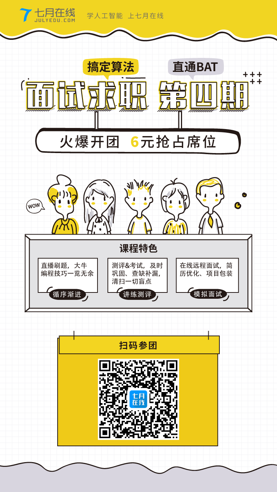

## 面试官角度出发的校招面试经验分享

# 个人简介
- 99年毕业，非计算机专业，20年经验老司机，现在四处流窜作案。
- 混过国企、外企、民企。
- 搞过游戏、数据库、云计算、电商和培训。
- 11年转管理岗候，参与过EMC/VMware/阿里每年的校招面试。

# 如何准备你的简历
- 精简精简精简，1页A4纸足矣，不能超过2页！
- 重点是什么：
  - 实习经验
  - 专业成绩
  - 学校项目
  - 其它都是多余的，80分以下不要放照片。
- 文体特长加上，学生会什么的不是管理层就算了（985的另说）

# 刷题的重要性
- 熟能生巧，临场发挥是靠不住的。
- 见多识广，举一反三。
- 刷题参考：LeetCode/LintCode
- 参考记录：https://github.com/yingl/LintCodeInPython

# 学会表达自己
- 除非能力超强，会说比会干重要。
- 台上10分钟，台下10年功。控制好时间内容，5分钟最多，
- 降低语速，练好普通话。

# 白板编程的要点
- 先确认题目和边界条件
- 不要先调入实现细节
- 先实现，再优化
- 没有思路怎么办？
- 注意边界条件
- 手工验证一遍再提交

# 开放性问题如何组织
- 平时注重知识广度的积累
- 尽量转换成自己的已知问题展开论述
- 回答之前先想好回答结构
- 不要怕说错，思路和逻辑更重要。

# 职业规划
- 实话实说，想做管理大胆讲出来。
- 如何实现路线要有预案

# 其它要点
- 面试套路：自我介绍 -> 白板编程 -> 开放性问题 -> 职业规划 -> 人生理想....
- 需要尽量避免的回答
- 不要贪图方便只看教材或中文书，多看点原版书。
- 多看大牛博客，比如 http://blog.csdn.net/han_xiaoyang / https://coolshell.cn/

# 广告时间

